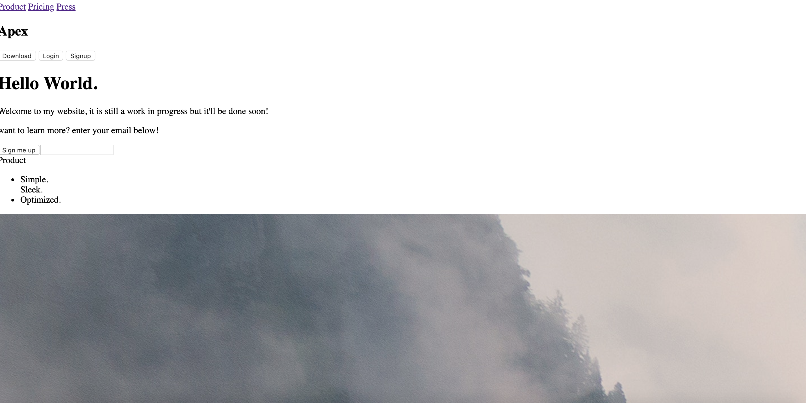

# Lab 1

### What went right
Most of what i was going for lined up with the design of the website i wanted to copy ( https://www.acorns.com/). I started to kind of go my own way in terms of design and wanted to focus more on getting a good flow and color sckeme while making sure that everything was able to be resized.
### What went wrong
I started to focus too much on the detail and wanted to get the website perfect. I got frusterated with spacing but got finally got the hang of it in the end.

### screen caps

